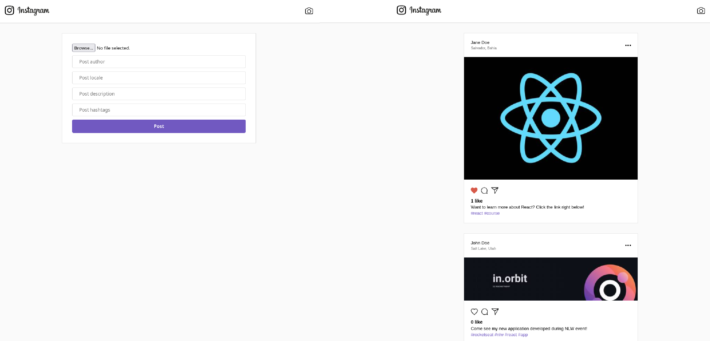

<p align="center">
  
</p>

<p align="center">
  
  
  
  
  
  
  
</p>

<p align="center">
  <a href="#-technologies">Technologies</a>&nbsp;&nbsp;&nbsp;|&nbsp;&nbsp;&nbsp;
  <a href="#-project">Project</a>&nbsp;&nbsp;&nbsp;|&nbsp;&nbsp;&nbsp;
  <a href="#-layout">Layout</a>&nbsp;&nbsp;&nbsp;|&nbsp;&nbsp;&nbsp;
  <a href="#memo-licença">Licença</a>
</p>

<p align="center">
  
</p>

<br>

<p align="center">
  
</p>

## 🚀 Technologies

This project was developed with the following technologies:

- HTML e CSS
- JavaScript
- React
- React Router DOM
- Node.js
- Express.js
- Mongoose
- Multer
- Sharp
- Socket.IO
- Nodemon
- Axios
- Cors
- Git e Github

## 💻 Project

This repository hosts instagram application, a project that simulates the social network, allowing users to create posts, like or dislike them. The project is divided into two parts: the backend and the frontend. The backend is built with Node.js and Express, while the frontend is developed using React.js.

## 💻 How to run

```bash
# Clone the repository
git clone https://github.com/filipebteixeira98/instagram-app.git

# Access the project folder
cd instagram-app

# Access the backend folder
cd backend
# Install the dependencies
yarn install
# or
yarn
# Start the backend server
yarn dev
# The backend will run on http://localhost:3333

# Access the frontend folder
cd ../frontend
# Install the dependencies
yarn install
# or
yarn
# Start the frontend server
yarn start
# The frontend will run on http://localhost:3000
```

## 📝 License

This project is under the MIT license.

<p align="center">
  Made with ♥ by me
</p>
